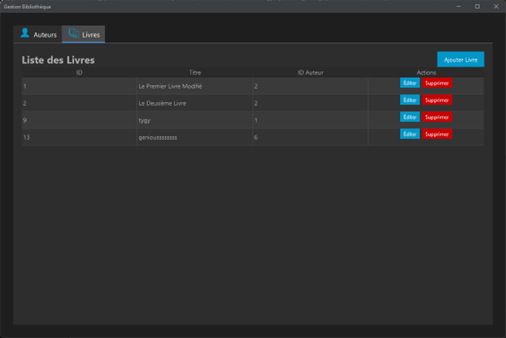
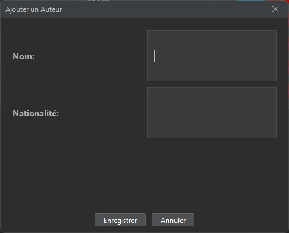
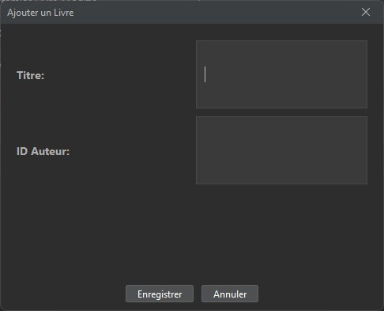
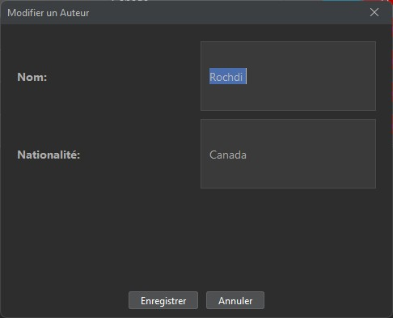
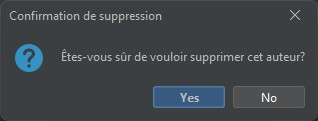
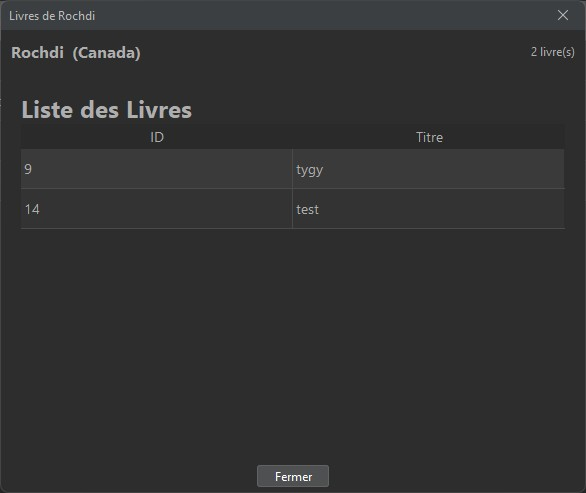

Here's a polished and structured README.md based on your project details:

# Gestion des Livres et Auteurs 📚

## 🎯 Project Overview
A desktop application to manage books and authors with full CRUD operations, built in 5 days using Java Swing and MySQL. Perfect for small libraries or book enthusiasts who want to organize their collections digitally!

## 🌟 Features
- **Complete CRUD Operations** for:
  - 📖 **Books**: Manage titles and link to authors
  - 🧑🏫 **Authors**: Track names and nationalities
- **Real-time Database Sync** with MySQL
- **Interactive Tables** with:
  - Edit/Delete buttons in-line
  - Automatic refresh after updates
- **MVC Architecture** for clean code organization
- **Data Validation** (e.g., required title field)
- **Foreign Key Protection** (Prevents deleting authors with existing books)

## 🛠️ Tech Stack
| Component | Technology |
|-----------|------------|
| Frontend  | Java Swing |
| Database  | MySQL      |
| Connector | JDBC       |
| Pattern   | MVC        |

## 🚀 Getting Started
1. **Clone the repo**  
   `git clone https://lnkd.in/gzdpnqkt`

2. **Set up MySQL database**  
   ```sql
   CREATE DATABASE biblio;
   CREATE TABLE Auteur (...); -- Full script in /src/db
   CREATE TABLE Livre (...);


3. **Update database credentials** in `DatabaseConnection.java`:
   ```java
   DriverManager.getConnection(
       "jdbc:mysql://localhost:3306/biblio", 
       "your_username", 
       "your_password"
   );
   ```

4. **Run the application**  
   `java -jar GestionBiblio.jar` or execute through your IDE

## 📝 Usage Demo
1. **Author List** 


2. **Add Author** → Automatically appears in author list



3. **Book List** 



4. **Create Book** → Select author from dropdown



5. **Edit** → Directly from table buttons



6. **Delete** → Directly from table buttons



7. **View Author's Books** → Click "Livres" button in author view



## 🧑💻 Contributors
| Name | GitHub | Portfolio |
|------|--------|-----------|
| Rochdi Mohamed Amine | [@rochdi]([https://github.com](https://github.com/Rocmine)) | [Portfolio]([https://lnkd.in/gstGipcS](https://rocmine.net/)) |
| Iliass Wakkar | [@iliass]([https://github.com](https://github.com/iliass-wakkar)) | [Portfolio]([https://lnkd.in/gstGipcS](https://iliass-wakkar.github.io/portfolio/)) |

## 📈 Future Enhancements
- 🔍 Full-text search
- 📊 Author publication statistics
- 📤 CSV/PDF export
- 🔒 User authentication system

## ⚠️ Known Limitations
- Requires manual database setup
- Single-user access only
- Basic error handling (to be enhanced)

## 📄 License
This project is licensed under the MIT License - see the [LICENSE.md](LICENSE.md) file for details.

---

Made with ❤️ in 4IIR9  
Check our [project report](docs/rapport.pdf) for full technical details
```

